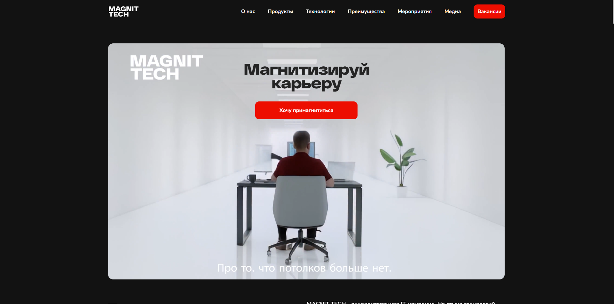
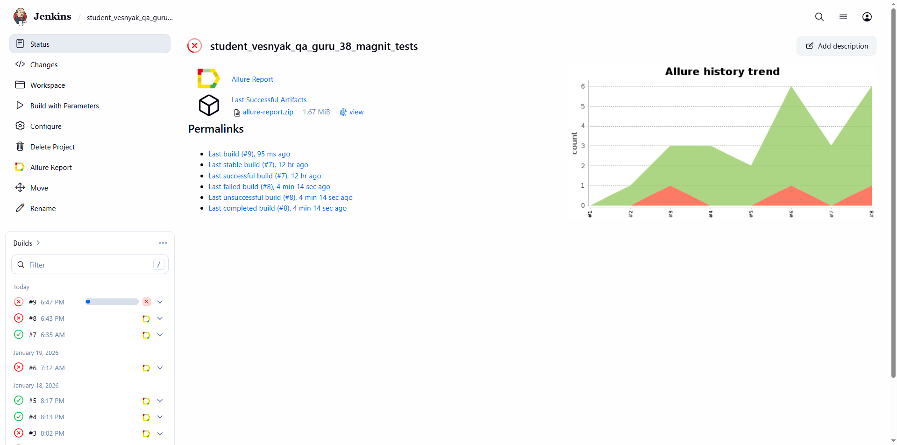
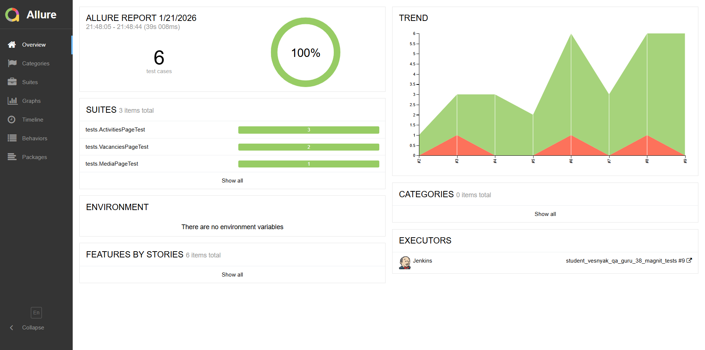
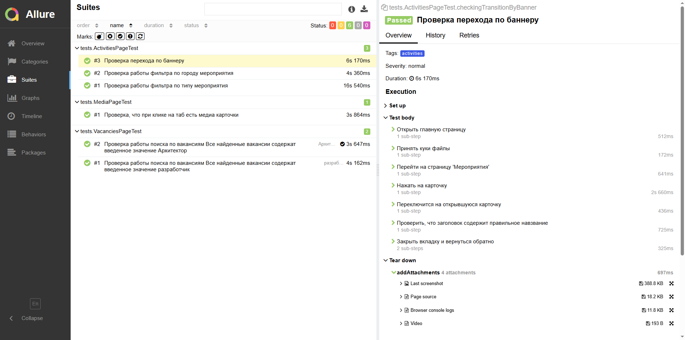
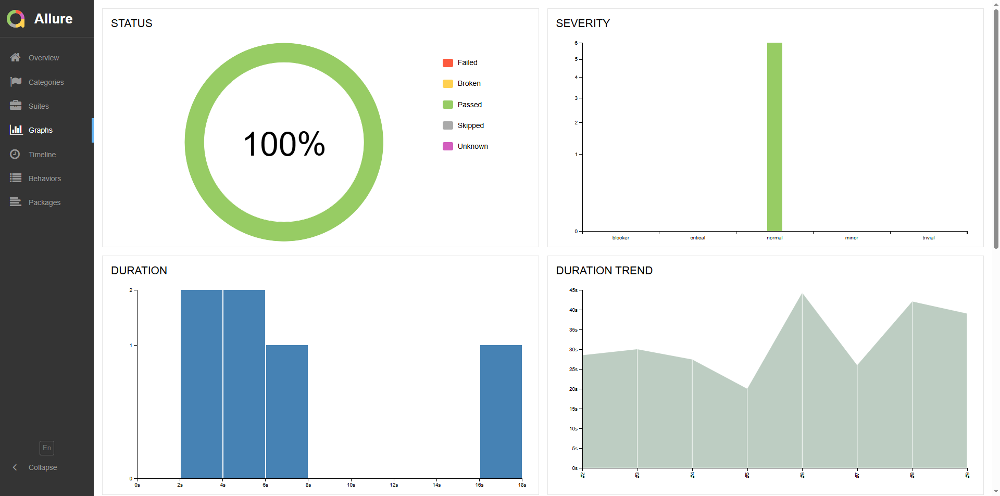
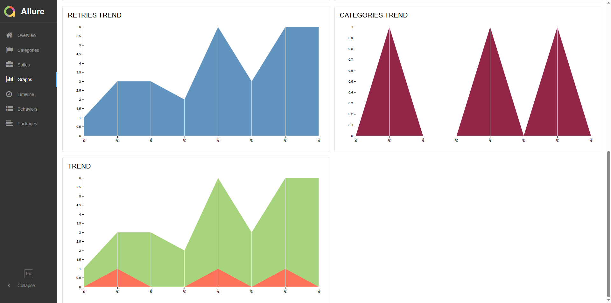
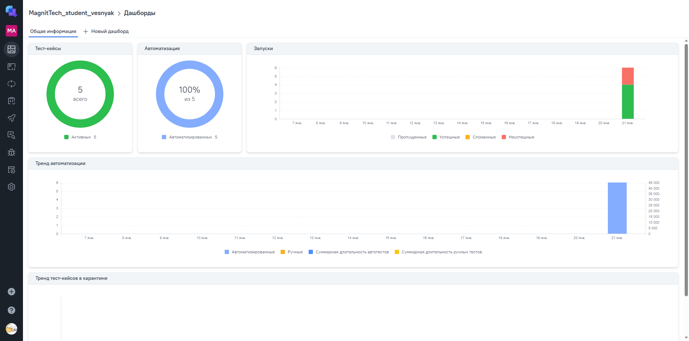
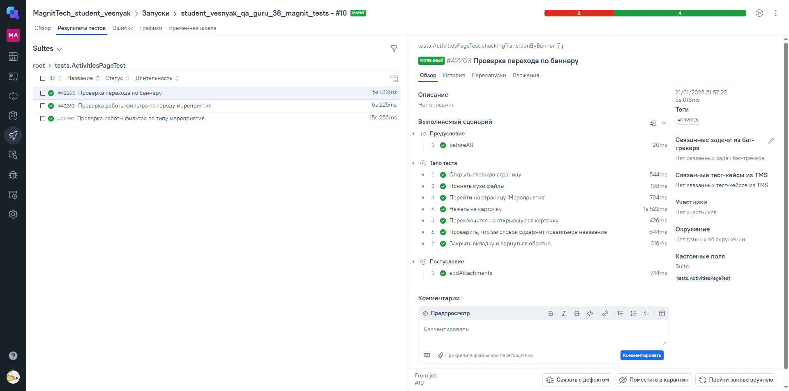
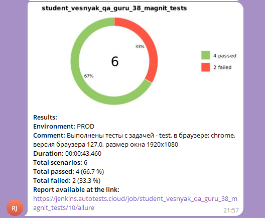
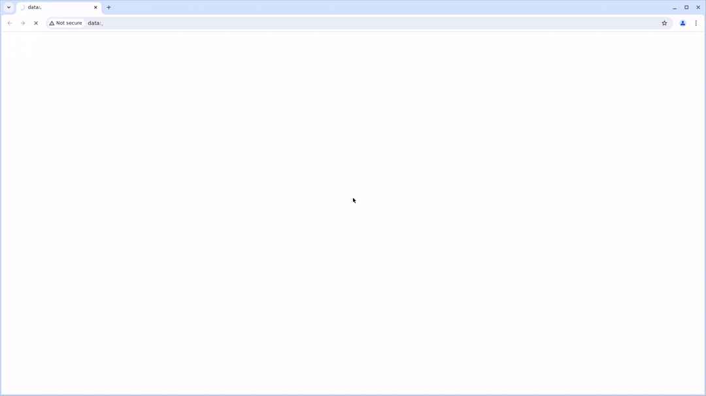

# Демо-проект по автоматизации тестирования для компании [Magnit Tech](https://magnit.tech/)
<p align="center">  
  
</p>  
____

## *Содержание*

* <a href="#tools">Технологии и инструменты</a>

* <a href="#cases">Примеры автоматизированных тест-кейсов</a>

* <a href="#jenkins">Сборка в Jenkins</a>

* <a href="#console">Запуск из терминала</a>

* <a href="#allure">Allure отчет</a>

* <a href="#allure-testops">Интеграция с Allure TestOps</a>

* <a href="#jira">Интеграция с Jira</a>

* <a href="#telegram">Уведомление в Telegram при помощи бота</a>

* <a href="#video">Примеры видео выполнения тестов на Selenoid</a>

_____

<a id="tools"></a>
## <a name="Технологии и инструменты">**Технологии и инструменты:**</a>
<p align="center">


</p>

_____

<a id="cases"></a>
## <a name="Примеры автоматизированных тест-кейсов">**Примеры автоматизированных тест-кейсов:**</a>

Страница "Мероприятия":
- проверка перехода по карточке мероприятия;
- проверка работы фильтра по городам;
- проверка работы фильтра по теме мероприятия;

Страница "Медиа":
- проверка работы переключения вкладок.

Страница "Вакансии":
- Параметризованный тест для проверки работы поиска по вакансиям.

____

<a id="jenkins"></a>
## <a name="Сборка"></a>Сборка в [Jenkins](https://jenkins.autotests.cloud/job/student_vesnyak_qa_guru_38_magnit_tests)</a>

<p align="center">  
  
</p>    

### **Параметры сборки в Jenkins:**
- task (выбор команды для запуска тестов, можно запускать отдельно по страницами, можно сразу все)
- browser (выбор браузера, по умолчанию chrome)
- browserVersion (выбор версии браузера, по умолчанию 127.0)
- browserSize (выбор размера окна браузера, по умолчанию 1920x1080)

____

<a id="console"></a>
## Команды для запуска из терминала
Локальный запуск:
```bash  
gradle clean test
```

Удаленный запуск через Jenkins:
```bash  
clean test
"-Dbrowser=${browser}"
"-DbrowserVersion=${browserVersion}"
"-DbrowserSize=${browserSize}"
"-DbaseUrl=${baseUrl}"
"-DremoteUrl=${remoteUrl}
```
____

<a id="allure"></a>
## <a name="Allure"></a>Allure [отчет](https://jenkins.autotests.cloud/job/student_vesnyak_qa_guru_38_magnit_tests/6/allure)</a>

### Основная страница отчёте
<p align="center">  
  
</p>  

### Тест-кейсы
<p align="center">  
  
</p>  

### Графики

<p align="center">  
  
</p>  
<p align="center">  
  
</p>  

____

<a id="allure-testops"></a>
## Интеграция с <a target="_blank" href="https://allure.autotests.cloud/project/5092/dashboards">Allure TestOps</a>

### Allure TestOps Dashboard
<p align="center">  
  
</p>  

### Тест-кейсы
<p align="center">  
  
</p>  

____

<a id="telegram"></a>
##  Уведомление в Telegram при помощи бота

<p align="center">  
  
</p>  

____

<a id="video"></a>
## Примеры видео выполнения тестов на Selenoid

<p align="center">  
  
</p>  

